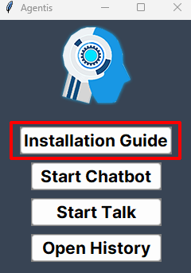
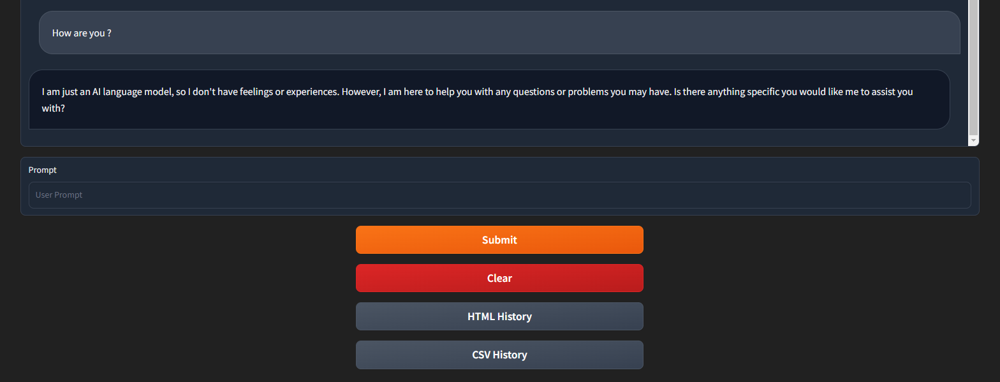
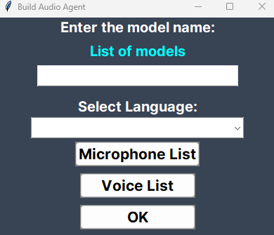
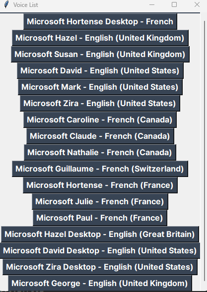

# Agentis


**Agentis** is an application with an interface to facilitate the installation of Ollama to download your **AI models locally** and also has a guide of the commands to execute.

Also, **Agentis** has a **dynamic web interface** with several themes and allows the user to chat with the model of their choice locally on a modern web interface, the text conversation can be saved in a CSV or HTML file.

Moreover, **Agentis** use several **synthetic voices** that you allow to talk with your local models.

To launch the code in python please be careful to have python install on your machine as well as all the required packages that you can find bellow.


## Run Agentis

You can click on the **'start-app.bat'** and the application will **launch and make the installation automatically**.

If you want to run the code from your code environment, do this :

=> You need to install **Python 3.11**

1-/ Clone this repository ```git clone https://github.com/nixiz0/Agentis.git```

2-/ Create your environment ```python -m venv .env```

3-/ Download required libraries ```pip install -r requirements.txt```

4- Run the main.py ```python main.py```

Once the main.py is launched please follow the **installation guide** to have Ollama and launch your server as well as install your models.




## ChatBot Info

As mentioned, you can chat with your models locally (with text) once you have launched the ollama server in parallel, you have the possibility to download in CSV and HTML your conversation, the files will be downloaded in your download directory from your computer.




## Talking with your Models



To talk to your model you must :
1. Put the model that you installed and launched in the first input.

2. Select a language, this is important because if you select the wrong language the voice recognition will not be adapted and will therefore not understand what you are saying.

3. Select from the list of all your microphones the one you want to use.

4. Select a voice from the list you have, obviously please select the synthetic voice which is adapted to your language (normally you will find next to each voice the language that the voice use).

And that's it, please remember to have launched your ollama server in parallel and to have installed the local models that you want to use for this to work.

**Vocal commands that you can use :**
- If you said these words in the same order followed by the video you want to search for **'recherche sur youtube', 'find on youtube', 'find in youtube'**, it will launch youtube and search the video that you asked.

- If you said these words in the same order **'quelle heure est-il', 'l\'heure actuelle', 'what time is it'**, it will return you the current time.

- If you said these words in the same order **'date actuelle', 'date d\'aujourd\'hui', 'current date', 'today\'s date', 'date of today'**, it will return you the current date.

- If you said these words in the same order **'sauvegarde notre discussion', 'sauvegarde notre conversation', 'sauvegarde la discussion', 'sauvegarde la conversation', 'save our discussion', 'save our conversation', 'save the discussion', 'save the conversation'**, it will saved all your discussion with the model on a CSV file (in your download folder).

- If you said these words in the same order **'stoppe notre discussion', 'stoppe notre conversation', 'stoppe la discussion', 'stoppe la conversation', 'stop our discussion', 'stop our conversation', 'stop the discussion', 'stop the conversation'**, it will stop the conversation.


## To have more Synthetic Voices Available (on Windows)



If you want to have more synthetic voices available, on Windows you have to go to the narrator settings and you can download the voices you want.

If this doesn't work and doesn't recognize the voices you have installed on the narrator settings, follow this steps :
1. Open the **Registry Editor** by pressing the **“Windows” and “R”** keys simultaneously, then type **“regedit”** and press Enter.

2. Navigate to the registry key : **HKEY_LOCAL_MACHINE\SOFTWARE\Microsoft\Speech_OneCore\Voices\Tokens**.

3. Export this key to a **REG file** (with a right click on the file).

4. Open this file with a text editor and replace all occurrences of **HKEY_LOCAL_MACHINE\SOFTWARE\Microsoft\Speech_OneCore\Voices\Tokens** 
with **HKEY_LOCAL_MACHINE\SOFTWARE\Microsoft\SPEECH\Voices\Tokens**.

5. Save the modified file and double-click it to import the changes to the registry.


## Tech Used

**AI-Models:** Ollama (version 0.1.20 minimum)

**Interface:** Tkinter

**Talk with AI:** pyaudio (detect audio devices) / pyttsx3 (text-to-speech conversion) / speech_recognition (recognize voice and translate to text)

**Computer Commands:** pywhatkit (search on youtube videos)


## Author

- [@nixiz0](https://github.com/nixiz0)